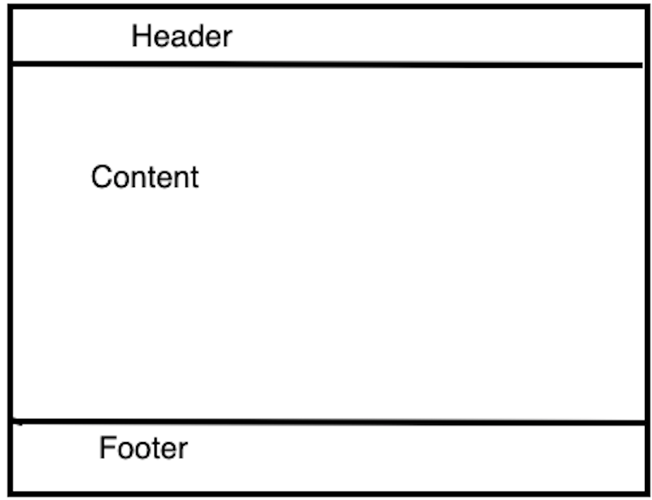
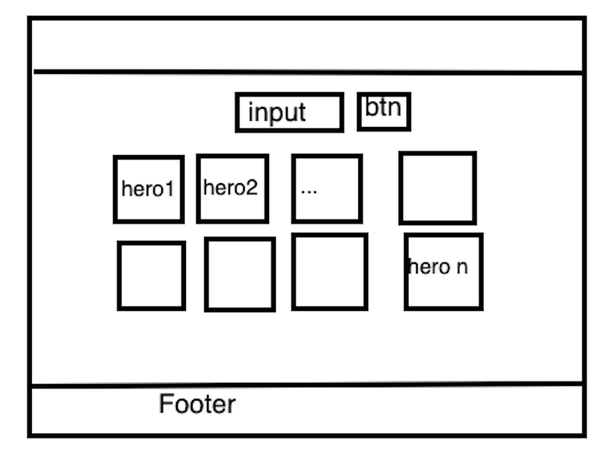
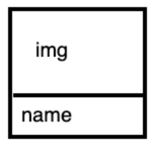
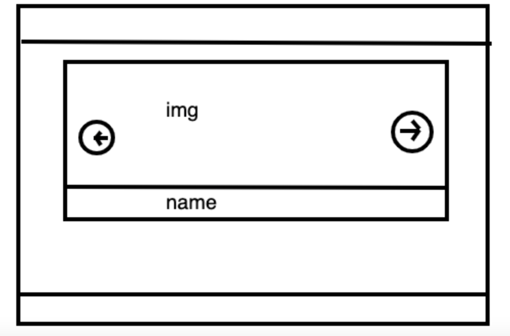
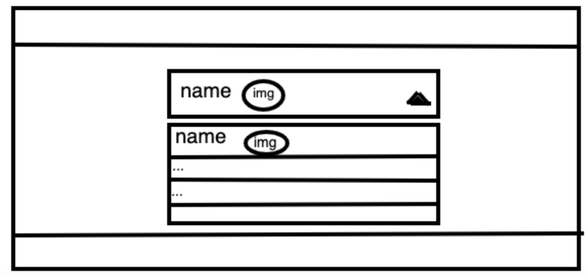

# Heroes task

## Задача

Создать приложение, которое должно содержать содержимое:

1. Одна страница. Эта страница будет содержать весть контент приложения. 

Структурно страница должна выглядеть следующим образом:



1. Header
2. Footer
3. Content

Теперь обо всем по порядку.

## Header


Header должен состоять из 3 вкладок, в зависимости от нажатой кнопки, в секции "Content" будет отображаться разное содержимое.

### Grid

Когда выбрана вкладка Grid, контент должен выглядеть следующим образом:



input и btn - инпут и кнопка соответственно, они нужны для того, чтобы фильровать героев по имени героев. Под инпутом и кнопкой находится сетка героев. Все, что подразумевается под по квадратиком с героем, это изображение героя img и имя героя name.



Введя имя героя в инпут, и нажав кнопку должен отображаться только один герой, который удовлетворяет результату поиска. Если ни один герой не удовлетворяет результату поиска, отображать вместо сетки героев текст: "Not found".

### Slider

Когда выбрана вкладка Slider, контент должен выглядеть следующим образом:



Слайдер должен быть спмописный, без использования библилтек. При нажатии на стрелки, слайды должны переключаться. В контексте нашего приложения, каждый слайд - это изображиние гироя и его имени.

### Dropdown

Когда выбрана вкладка Dropdown, контент должен выглядеть следующим образом:



Dropdown должен быть самописный, без использования библиотек.
В контексте нашего приложения, Dropdown должен содержать список всех героев. Каждый элемент выпадающего списка представляет собой: имя героя name и иконку героя img. В инпуте должен отображаться выбранный герой. Если ничего не выбрано в Dropdown, то отображать текст: "Choose a hero".

Список используемых технологий:

1. html/css/js
2. handlebars (шаблонизатор) https://handlebarsjs.com/
3. axios (инструмент для осуществления запросов) https://github.com/axios/axios

Проект имеет базовую конфигурацию, для запуска которой необходимо ввести в консоль ```npm start```. С помощью webpack и handlebars делается попытка организовать код по типу компонентного подхода. Изучив базовую конфигурацию, вы можете убедиться, что с помощью partials (фича handlebars) структура проекта разделена на самостаятельные единицы, например

Рекомендуемый порядок выполнения задания:
1. Grid
2. Slider
3. Dropdown

Для выполнения задания необходимо разобраться с тем как работать с handlebars. Шаблонизатор не сложный, но на понимания базового синтаксиса понадобится некоторе время.

Так же изучите файл webpack.config.js, в нем кроме конфига вебпака добавляются js файлы, изучите как, иначе не будет работать.